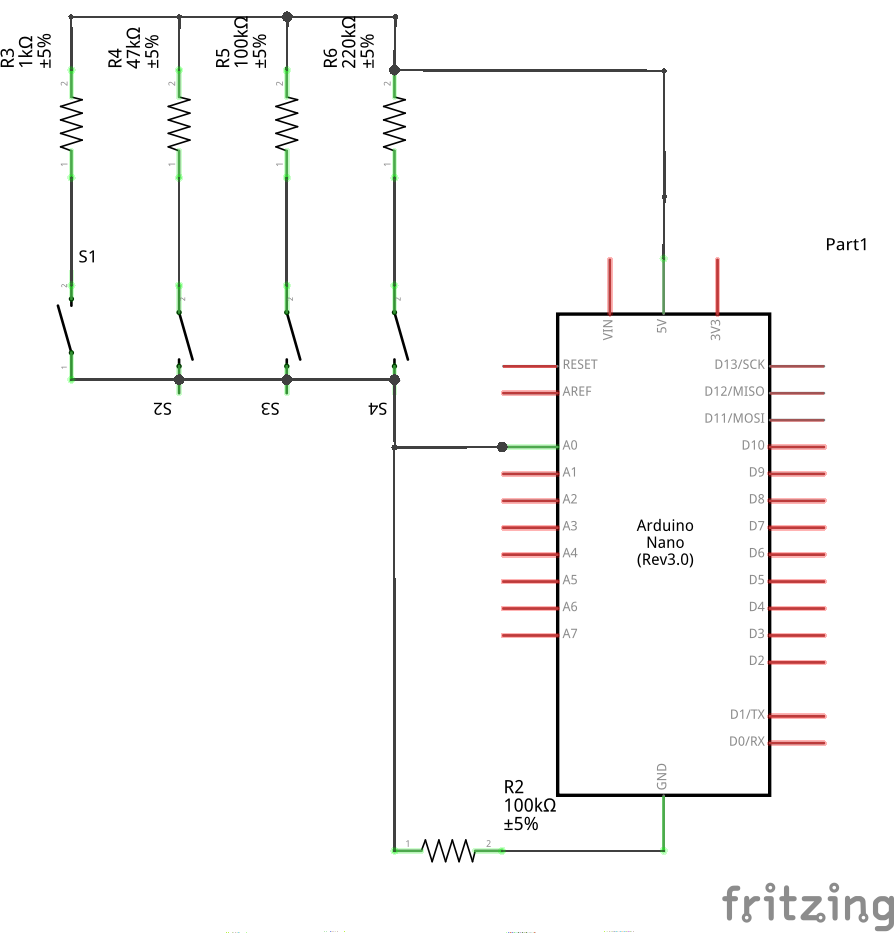

# ArduinoButtonManager

This library allows to connect multiple switches to a single analog pin. This works by sending a different voltage for each pressed button.

You should be able to connect up to 10 switches per pin easily.
